## **Project overview**

2주간의 미니프로젝트 주제를 고르면서

가장 중요하게 생각한것이 2가지가 있습니다

1. CRUD

   웹 의 가장 기본이 되는 CRUD 를 적절하게 할 수 있는 프로젝트

2. 대중성

   대부분의 사람이 알만한 사이트를 클론한 프로젝트

이에 대한 이유는 다음과 같습니다.

첫째 CRUD는 웹 개발에서 가장 기본적인 기능이며, 이를 수행하는 데에 능숙해지는 것은 개발자로서 중요하며 유튜브는 이에 적합한 기능을 가지고 있습니다.

둘째 대중성 있는 사이트를 클론 코딩하는 것은 많은 사람들이 사용하는 서비스의 구조와 기능을 배울 수 있어 유용합니다.

하지만 완전히 똑같은 기능의 유튜브 가 아닌 기존 유튜브에 부족한 부분의 여러가지 기능을 추가하거나 변경 하고자 노력 하였습니다.

## 시연영상

https://www.youtube.com/embed/Uop4cV5By24

## 작업기간

2023.04.17 ~ 2023.05.01

## 기술스택

### 프론트엔드

- HTML/CSS
- JavaScript
- BootStrap

### 백앤드

- JQuery
- Ajax
- Mybatis
- JDBC
- MySQL
- Spring

### 협업도구

- git
- github
- Notion

### 개발보조도구

- Pigma

## 개인 역할별 기능 구현 사항
- [권용준](https://github.com/kwonyongjun9978)

   1. Pigma 설계
   
      각 페이지별 기능과 특성을 정리해놓은 피그마입니다.
      
      [https://www.figma.com/file/I4QHHICr4rTxX3Mioc4Z4c/minProject?type=design&node-id=0-1&t=oqo07FQJ0Vughpze-0](https://www.figma.com/file/I4QHHICr4rTxX3Mioc4Z4c/minProject?type=design&node-id=0-1&t=oqo07FQJ0Vughpze-0)

   2. 로그인 기능 구현
        
      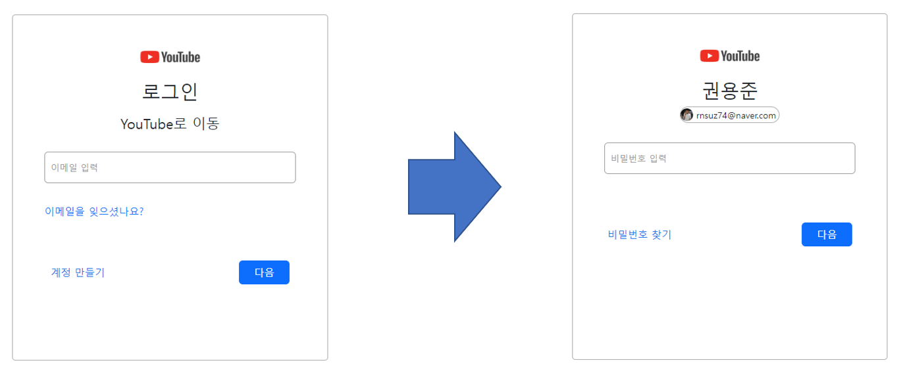
   
      입력 받은 email값을 가지고 DB로 가서 select후 일치하는 email이 있을 경우 DTO에 담아 return한 후 입력 받은 email값을 다음페이지(Controller에서 Model을 사용) 로 넘겨준다.
   Password를 입력하는 로그인 창에서는 넘겨받은 email과 입력 받은 password를 가지고 DB에 가서 select를 진행한후 DTO로 값이 넘어오면 user_id라는 session값이 생성되면서 메인페이지로 이동을 합니다.
   
      cf) Password를 입력하는 로그인 창에서 전 페이지에서 넘겨받은 email데이터를 가지고 DB에서 select를 진행 후 DTO로 값을 넘겨받아서 이름값과 프로필 사진, email값을 화면에 뿌려준다.

   3. 회원가입 기능(+이메일 인증) 구현
 
      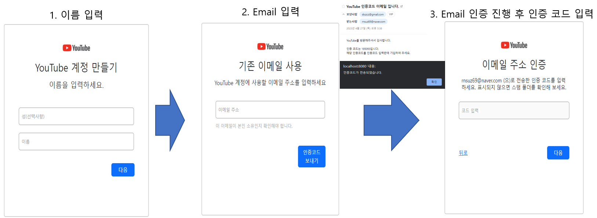 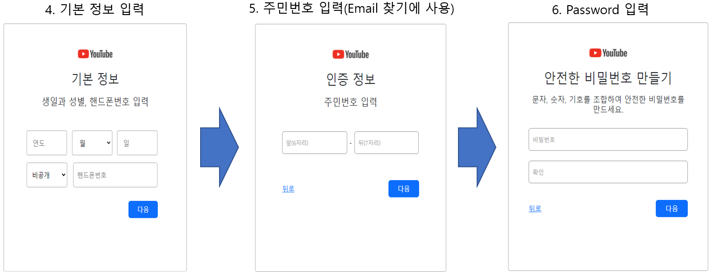
      
      페이지마다 Form 태그로 input데이터를 submit 한 후 controller에서 map으로 담아 다음페이지로 넘겨준다.
그리고 다음페이지에 map으로 담은 데이터를 뿌려준 후 다시 Form 태그로 input 데이터(전 페이지의 데이터포함)를 submit 한 후 controller에서 map으로 담아 다음페이지에 뿌려준다(이 과정 계속 반복)
      그렇게 마지막 페이지(비밀번호 입력 창)에서 모든 데이터 넘겨받은 후 ajax를 써서 모든 데이터를 DB에 insert 한다.

      cf) Email은 중복값 허용X, 회원가입이 완료되면 Email을 입력하는 로그인 창으로 이동

   4. Email 찾기 기능 구현
 
      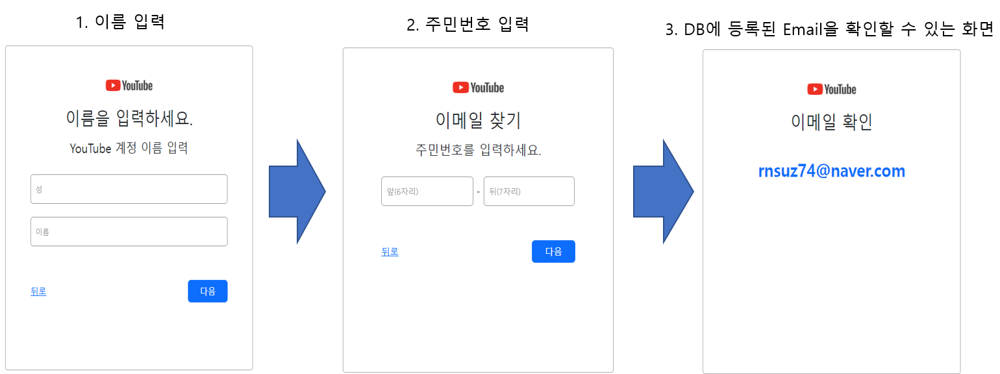
 
      Email을 입력하는 로그인 화면에서 “이메일을 잊으셧나요?” 클릭 후 진행
      
      이름을 입력하면 입력 받은 이름값을 가지고 DB로 가서 select를 진행 한 후 DB에 등록되어 있는 이름인지 확인한 후 DTO값을 return 받아서 이름값을 다음페이지로 넘겨준다.
다음페이지(주민번호입력)에서 입력 받은 주민번호와 전 페이지에서 넘겨받은 이름값을 가지고 DB에 가서 select를 진행한후 DB에 해당 이름과 주민번호가 일치하는 데이터가 있으면 DTO로 return받아서 name값을 다음페이지로 넘겨준다.
넘겨받은 name값을 가지고 DB로 가서 select를 진행한후 DTO로 return받아서 email데이터를 동적처리를 사용해서 화면에 뿌려줍니다.

      cf) 이메일 확인창에서 해당 Email을 클릭하면 Password를 입력하는 로그인 화면으로 이동

   5. Password 찾기 기능(+이메일 인증) 구현

      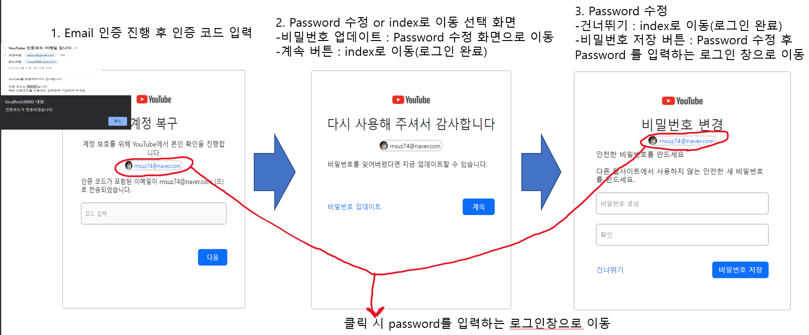

      Password를 입력하는 로그인 화면에서 좌측 하단의 “비밀번호 찾기“ 클릭 후 진행

   6. 회원정보 수정 기능 구현

      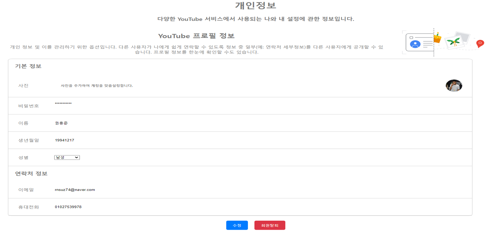

      메인 페이지에서 계정 관리 클릭 후 진행

      “user_id”라는 session값으로  DB에서 데이터를 select한 후 DTO에 담아서 회원정보 수정창에 뿌려준다.
      
      프로필 사진 등록, 비밀번호, 이름, 생년월일, 성별, 휴대전화번호 변경 가능
      
      Email은 변경X(readonly)

   7. 회원탈퇴 기능 구현

      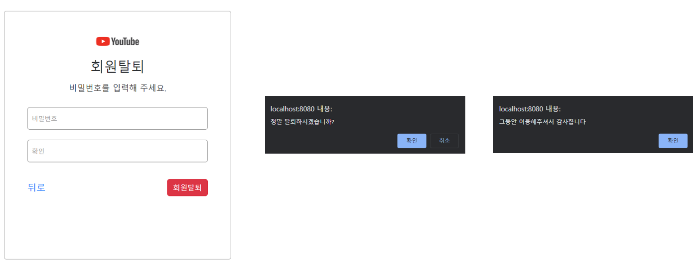

      회원정보 수정창에서 회원탈퇴 버튼 클릭 후 진행

      비밀번호를 입력한 후 회원탈퇴 진행

   8. 이미지 업로드 기능 구현

      프로필 사진 및 썸네일 등록, 변경이 가능하다

   

- [강성욱](https://github.com/ksqrt)
  
   1. DB 설계
   
      프로젝트를 위해 철저한 분석과 계획을 거쳐 데이터베이스의 구조와 관계를 결정하고, 이를 시각적으로 표현하는 DB 설계를 완료했습니다. 이를 통해 미니프로젝트의 데이터 관리와 처리, 그리고 안정적인 시스템 운영을 지원할 수 있도록 하였습니다.
   
      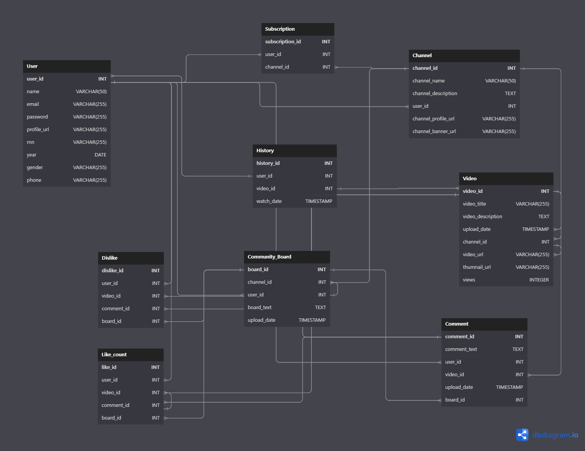
   
      자세히
   
      [A Free Database Designer for Developers and Analysts](https://dbdiagram.io/d/64365bc58615191cfa8d3d10)
   
   2. Video 페이지 구현
   
      Video 페이지는 동영상을 시청하는 데 중요한 기능을 많이 제공합니다. 기능은 다음과 같습니다.
   
      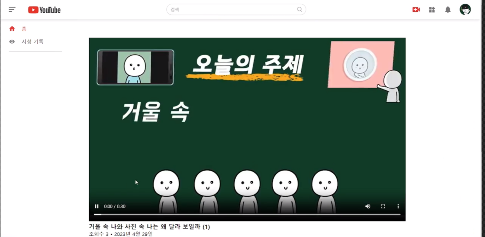
   
      1. 동영상 플레이어: Video 페이지의 핵심 기능은 동영상을 시청할 수 있는 플레이어입니다. 플레이어는 영상을 재생, 일시 중지, 전체 화면모드,볼륨조절 등 다양한 기능을 제공합니다.
   
         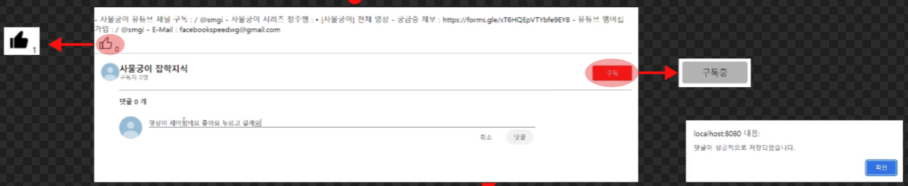
   
      2. 동영상 정보: 해당 동영상의 정보를 확인할 수 있습니다. 이를 통해 사용자는 해당 동영상의 타이틀, 회수, 업로드일, 동영상 세부설명, 동영상의 좋아요 수 를 알 수 있습니다.
   
         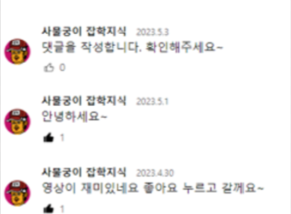
   
      3. 댓글: 사용자는 Video 페이지에서 동영상에 대한 댓글을 작성할 수 있습니다. 이를 통해 사용자는 다른 사람들과 의견을 공유하고, 동영상과 관련된 질문을 하거나 대화를 할 수 있습니다.
      4. 좋아요: 사용자는 Video 페이지에서 동영상에 대한 좋아요를 눌러 자신의 의견을 표시할 수 있습니다. 이를 통해 다른 사용자들은 동영상의 평판을 알 수 있습니다.
      5. 구독: Video 페이지에서는 해당 비디오를 업로드한 채널을 구독할 수 있습니다. 해당 채널을 구독하면 오른쪽 네비게이션 바 에 구독 목록이 활성화 됩니다.
   
   3. 채널 페이지 구현
      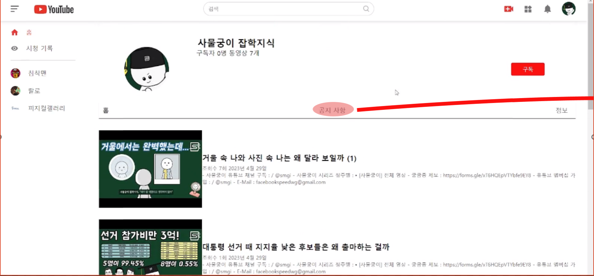
      채널 페이지는 동영상을 업로드한 채널에 대한 정보를 제공합니다.
   
      기능은 다음과 같습니다.
   
      1. 동영상 목록: 채널 페이지에서는 해당 채널에서 업로드한 동영상 목록을 확인할 수 있습니다. 이를 통해 사용자는 해당 채널에서 제공하는 콘텐츠를 쉽게 찾아서 시청할 수 있습니다.
   
      2. 채널 정보: 채널 페이지에서는 해당 채널의 정보를 확인할 수 있습니다. 이를 통해 사용자는 채널을 운영하는 사람이 누구인지, 구독자가 몇명인지, 동영상이 몇개인지를 알 수 있습니다.
   
      3. 구독: 채널 페이지에서는 해당 채널을 구독할 수 있습니다. 해당 채널을 구독하면 오른쪽 네비게이션 바 에 구독 목록이 활성화 됩니다.
   
   4. History 페이지 구현
      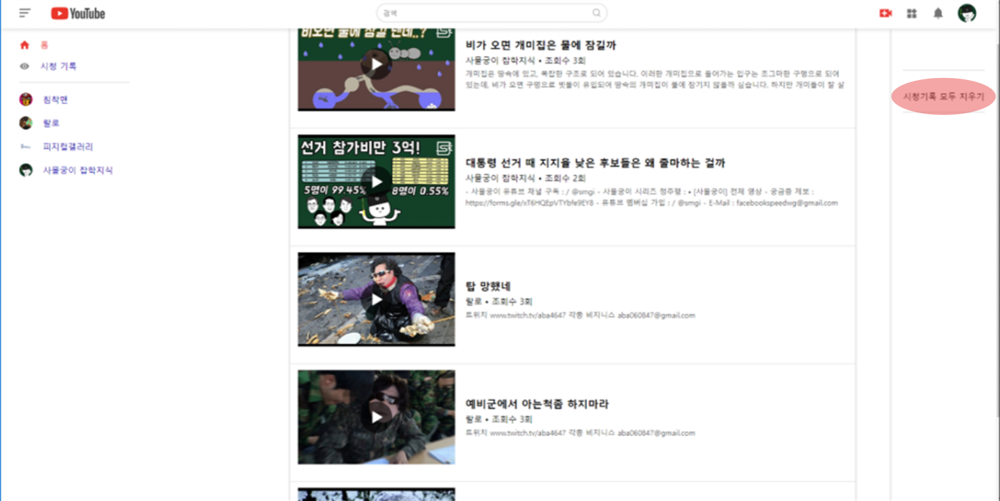
      기능: 시청 기록에는 사용자가 이전에 시청한 동영상 목록이 저장되어 있습니다. 이러한 기록을 통해 사용자는 다음과 같은 기능을 이용할 수 있습니다.
   
      1. 다시 시청하기: 유튜브의 시청 기록에서는 사용자가 이전에 시청한 동영상 목록이 저장되어 있습니다. 이때 날짜 별로 동영상 목록이 활성화 되며 이를 통해 사용자는 다시 시청하고 싶은 동영상을 쉽게 찾아서 시청할 수 있습니다.
   
         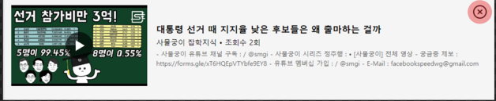
   
      2. 시청 기록 삭제: 유튜브의 시청 기록에서는 사용자가 시청한 동영상 목록이 저장되어 있습니다. 사용자는 이를 삭제할 수 있어서 다른 사람이 자신의 시청 기 록을 보지 못하도록 할 수 있습니다. 이때 호버링시 X 표시가 보이며 누를시 삭제됩니다.
- [김동빈](https://github.com/dd1761)
- [이지현](https://github.com/jihyunah)
- [송성근](https://github.com/gkdltjdrms)

