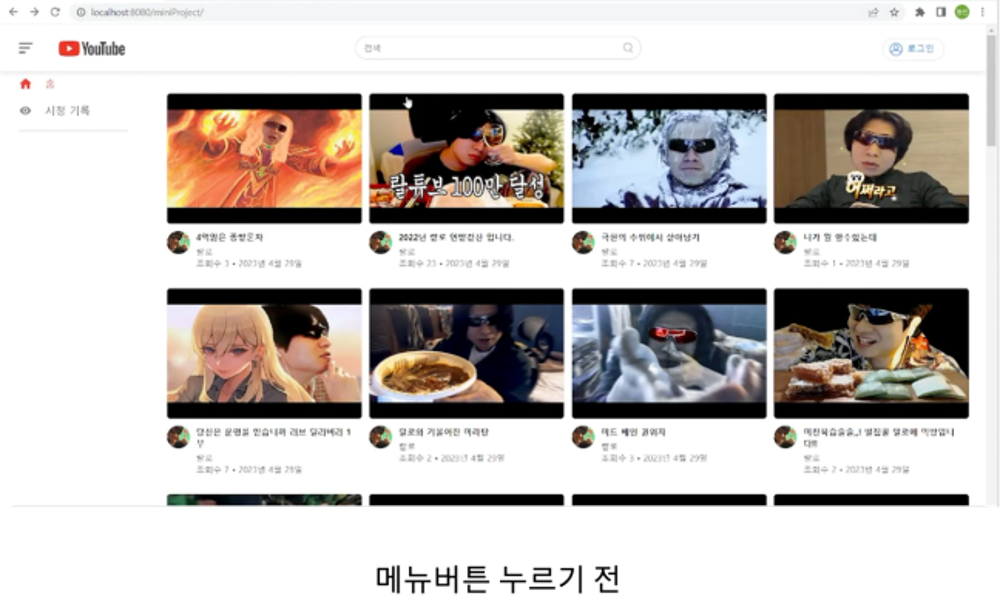
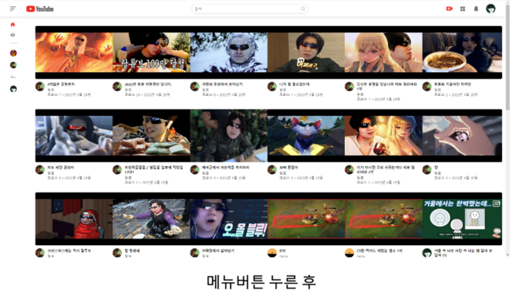
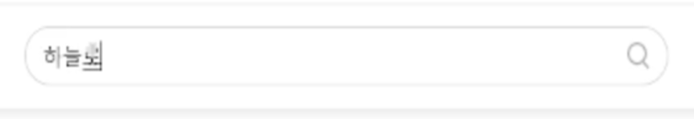
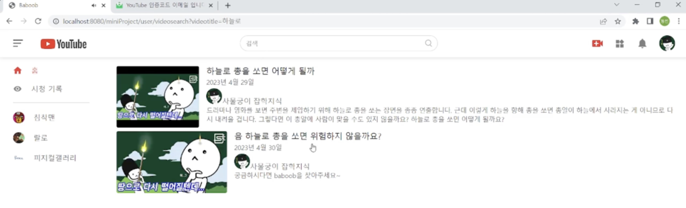
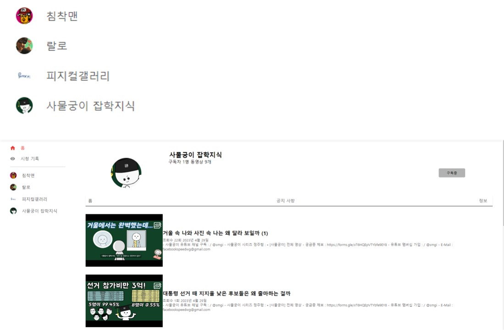
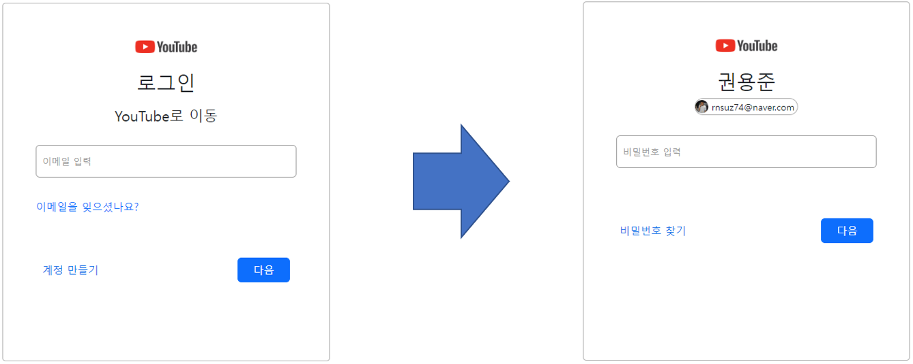
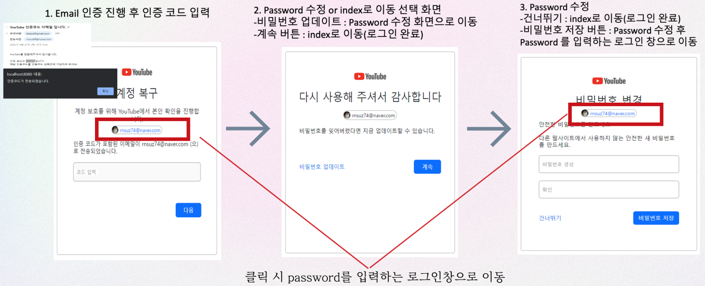

## **Project overview**

2주간의 미니프로젝트 주제를 고르면서

가장 중요하게 생각한것이 2가지가 있습니다

1. CRUD

   웹 의 가장 기본이 되는 CRUD 를 적절하게 할 수 있는 프로젝트

2. 대중성

   대부분의 사람이 알만한 사이트를 클론한 프로젝트

이에 대한 이유는 다음과 같습니다.

첫째 CRUD는 웹 개발에서 가장 기본적인 기능이며, 이를 수행하는 데에 능숙해지는 것은 개발자로서 중요하며 유튜브는 이에 적합한 기능을 가지고 있습니다.

둘째 대중성 있는 사이트를 클론 코딩하는 것은 많은 사람들이 사용하는 서비스의 구조와 기능을 배울 수 있어 유용합니다.

하지만 완전히 똑같은 기능의 유튜브 가 아닌 기존 유튜브에 부족한 부분의 여러가지 기능을 추가하거나 변경 하고자 노력 하였습니다.

## 팀원

<table>
  <tr>
    <td align="center">
       
      <b>팀장: 김동빈</b>
    </td>
    <td align="center">
        
      <b>팀원: 강성욱</b>
    </td>
    <td align="center">
        
      <b>팀원: 권용준</b>
    </td>
    <td align="center">
        
      <b>팀원: 이지현</b>
    </td>
    <td align="center">
        
      <b>팀원: 송성근</b>
    </td>
  </tr>
</table>

## 시연영상

https://www.youtube.com/embed/Uop4cV5By24

## 작업기간

2023.04.17 ~ 2023.05.01

## 기술스택

### 개발보조도구

- Pigma

## 개인 역할별 기능 구현 사항

- [김동빈](https://github.com/dd1761)

 1. 메인 화면
     메뉴 버튼을 누르게 되면 메인화면이 최대화면으로 확장됩니다. 
     유튜브 로고를 누르게 되면 메인화면으로 이동하게 됩니다. 
     유튜브의 모든 영상들의 썸네일이 나타나게 됩니다. 
   
  
  <table>
     <td>
        
     </td>
     <td>
        
     </td>
  </table>

2. 검색기능
   검색창에 검색할 단어를 넣고 엔터 혹은 검색버튼을 누르게 되면 해당되는 제목 혹은 채널명이 검색됩니다.
   
<table align="center">
  <tr>
    <td>
      
    </td>
  </tr>
  <tr>
    <td>
      
    </td>
  </tr>
</table>

3. 구독 목록
   왼쪽의 구독 목록에 채널을 누르게 되면 각 채널페이지로 이동하게 됩니다.
   
   

- [권용준](https://github.com/kwonyongjun9978)
   1. Pigma 설계
   
      각 페이지별 기능과 특성을 정리해놓은 피그마입니다.
      
      [https://www.figma.com/file/I4QHHICr4rTxX3Mioc4Z4c/minProject?type=design&node-id=0-1&t=oqo07FQJ0Vughpze-0](https://www.figma.com/file/I4QHHICr4rTxX3Mioc4Z4c/minProject?type=design&node-id=0-1&t=oqo07FQJ0Vughpze-0)

   2. 로그인 기능 구현
        
      
   
      로그인은 Email을 입력하는 페이지와 Password를 입력하는 페이지를 Google로그인 형식에 맞게 페이지를 따로 분리하여 구현했습니다.
   
      Password를 입력하는 로그인 창에서 전 페이지에서 넘겨받은 Email데이터를 이름값과 프로필 사진, Email값을 화면에 뿌려줍니다.

   3. 회원가입 기능(+이메일 인증) 구현
 
       
 
      회원가입을 진행할때 아이디는 기존의 이메일을 사용합니다.
      
      이메일 인증 기능을 추가하여 보안성을 강화하였습니다.
      
      주민번호는 Email을 찾는데 사용됩니다.
      
      Email은 중복값 허용X, 회원가입이 완료되면 Email을 입력하는 로그인 창으로 이동합니다.

   4. Email 찾기 기능 구현
 
      
 
      Email을 입력하는 로그인 화면에서 “이메일을 잊으셧나요?” 클릭 후 진행합니다.
 
      회원가입시 입력했던 이름과 주민번호를 통해 Email을 찾을 수 있습니다.

      이메일 확인창에서 해당 Email을 클릭하면 Password를 입력하는 로그인 화면으로 이동합니다.

   5. Password 찾기 기능(+이메일 인증) 구현

      

      Password를 입력하는 로그인 화면에서 좌측 하단의 “비밀번호 찾기“ 클릭 후 진행
      
      Password 찾기를 할 때도 이메일 인증 기능을 추가하였습니다.

   6. 회원정보 수정 기능 구현

      

      메인 페이지에서 계정 관리 클릭 후 진행합니다.
      
      프로필 사진 등록, 비밀번호, 이름, 생년월일, 성별, 휴대전화번호 변경 가능합니다.
      
      Email은 변경X(readonly)

   7. 회원탈퇴 기능 구현

      

      회원정보 수정창에서 회원탈퇴 버튼 클릭 후 진행

      비밀번호를 입력한 후 회원탈퇴 진행

   8. 이미지 업로드 기능 구현

      프로필 사진 및 썸네일 등록, 변경이 가능합니다.

   
- [강성욱](https://github.com/ksqrt)
  
   1. DB 설계
   
      프로젝트를 위해 철저한 분석과 계획을 거쳐 데이터베이스의 구조와 관계를 결정하고, 이를 시각적으로 표현하는 DB 설계를 완료했습니다. 이를 통해 미니프로젝트의 데이터 관리와 처리, 그리고 안정적인 시스템 운영을 지원할 수 있도록 하였습니다.
   
      
   
      자세히
   
      [A Free Database Designer for Developers and Analysts](https://dbdiagram.io/d/64365bc58615191cfa8d3d10)
   
   2. 채널 페이지 구현
      
      채널 페이지는 동영상을 업로드한 채널에 대한 정보를 제공합니다.
   
      기능은 다음과 같습니다.
   
      1. 동영상 목록: 채널 페이지에서는 해당 채널에서 업로드한 동영상 목록을 확인할 수 있습니다. 이를 통해 사용자는 해당 채널에서 제공하는 콘텐츠를 쉽게 찾아서 시청할 수 있습니다.
   
      2. 채널 정보: 채널 페이지에서는 해당 채널의 정보를 확인할 수 있습니다. 이를 통해 사용자는 채널을 운영하는 사람이 누구인지, 구독자가 몇명인지, 동영상이 몇개인지를 알 수 있습니다.
   
      3. 구독: 채널 페이지에서는 해당 채널을 구독할 수 있습니다. 해당 채널을 구독하면 오른쪽 네비게이션 바 에 구독 목록이 활성화 됩니다.
   
   3. History 페이지 구현
      
      기능: 시청 기록에는 사용자가 이전에 시청한 동영상 목록이 저장되어 있습니다. 이러한 기록을 통해 사용자는 다음과 같은 기능을 이용할 수 있습니다.
   
      1. 다시 시청하기: 유튜브의 시청 기록에서는 사용자가 이전에 시청한 동영상 목록이 저장되어 있습니다. 이때 날짜 별로 동영상 목록이 활성화 되며 이를 통해 사용자는 다시 시청하고 싶은 동영상을 쉽게 찾아서 시청할 수 있습니다.
   
         
   
      2. 시청 기록 삭제: 유튜브의 시청 기록에서는 사용자가 시청한 동영상 목록이 저장되어 있습니다. 사용자는 이를 삭제할 수 있어서 다른 사람이 자신의 시청 기 록을 보지 못하도록 할 수 있습니다. 이때 호버링시 X 표시가 보이며 누를시 삭제됩니다.
     
## 공동 개발
<table>
  <tr>
    <td align="center">
       
      <b>김동빈</b>
    </td>
    <td align="center">
        
      <b>강성욱</b>
    </td>
  </tr>
</table>

### Video 페이지 구현

Video 페이지는 동영상을 시청하는 데 중요한 기능을 많이 제공합니다. 기능은 다음과 같습니다.

1. 동영상 플레이어(동빈, 성욱): Video 페이지의 핵심 기능은 동영상을 시청할 수 있는 플레이어입니다. 플레이어는 영상을 재생, 일시 중지, 전체 화면 모드, 볼륨 조절 등 다양한 기능을 제공합니다.

   

2. 동영상 정보(동빈, 성욱): 해당 동영상의 정보를 확인할 수 있습니다. 이를 통해 사용자는 해당 동영상의 타이틀, 조회수, 업로드일, 동영상 세부 설명, 동영상의 좋아요 수 등을 알 수 있습니다.

   

3. 댓글 (성욱) : 사용자는 Video 페이지에서 동영상에 대한 댓글을 작성할 수 있습니다. 이를 통해 사용자는 다른 사람들과 의견을 공유하고, 동영상과 관련된 질문을 하거나 대화를 할 수 있습니다.

4. 좋아요 (동빈) : 사용자는 Video 페이지에서 동영상에 대한 좋아요를 눌러 자신의 의견을 표시할 수 있습니다. 이를 통해 다른 사용자들은 동영상의 평판을 알 수 있습니다.

5. 구독 (성욱) : Video 페이지에서는 해당 비디오를 업로드한 채널을 구독할 수 있습니다. 해당 채널을 구독하면 오른쪽 네비게이션 바에 구독 목록이 활성화됩니다.

- [이지현](https://github.com/jihyunah)
- [송성근](https://github.com/gkdltjdrms)

